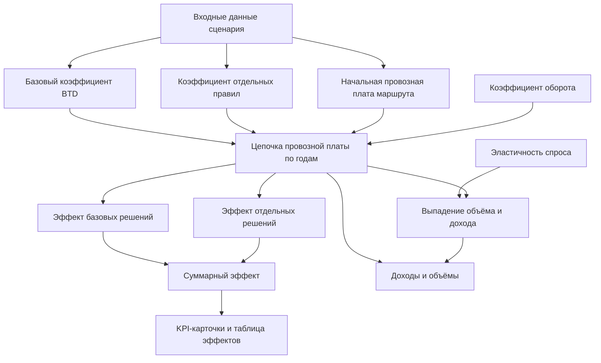

# Формулы расчёта на странице «Эффект от решений»

Справочник для аналитиков и пользователей системы. Документ описывает, **что считается и как**, с привязкой к блокам страницы «Эффект от решений».

---

## 1. Введение

### Назначение страницы

Страница оценивает **эффект тарифных решений** по провозной плате:

- **базовая индексация** (коэффициенты BTD — базовые тарифные решения);
- **отдельные тарифные правила** (индексация и прочие решения по условиям маршрута).

Дополнительно учитывается **эластичность спроса** (выпадение объёма и дохода при изменении тарифа), если в сценарии задан набор эластичности.

### Единицы измерения

| Уровень | Деньги | Объём |
|--------|--------|-------|
| Внутренние расчёты | руб. | т |
| Отображение на экране | млрд руб. (деление на $10^9$) | млн т (деление на $10^6$) |

### Входные данные

- выбранный **сценарий** (горизонт лет, настройки BTD, правил, эластичности, оборота);
- **маршруты** из витрины перевозок (начальная провозная плата, объём и др.);
- **коэффициенты BTD** по годам и категориям;
- **тарифные правила** с коэффициентами и долей применения;
- параметры **эластичности** (кривые, режим коэффициента удержания, загрузка предприятия) — если включены.

---

## 2. Общая логика расчёта

Кратко: по каждому маршруту строится цепочка провозной платы по годам, из неё извлекаются **годовые приросты** (эффект базовых и отдельных решений). Эти приросты агрегируются в KPI и таблицу эффектов. Абсолютные доходы и объёмы берутся из той же цепочки; при включённом «учёте выпадения» к ним добавляется коррекция по эластичности.

---

## 3. Базовые формулы

Формулы ниже используются во всех блоках страницы.

### 3.1. Эффективный коэффициент тарифного правила

Учитывает долю применения правила (`base_percent`, %):

$$
k_{\mathrm{eff}} = 1 + (k_{\mathrm{raw}} - 1) \times \frac{\mathrm{base\_percent}}{100}
$$

где $k_{\mathrm{raw}}$ — исходный коэффициент правила за год.

**Пример:** $k_{\mathrm{raw}} = 1{,}10$, `base_percent` = 50 → $k_{\mathrm{eff}} = 1 + 0{,}10 \times 0{,}5 = 1{,}05$.

### 3.2. Комбинированный коэффициент правил за год

Произведение эффективных коэффициентов всех правил, подходящих к маршруту в году $y$:

$$
K_{\mathrm{rules}}(y) = \prod_i k_{\mathrm{eff},i}(y)
$$

Если подходящих правил нет, $K_{\mathrm{rules}}(y) = 1$.

### 3.3. Базовый коэффициент BTD за год

$$
K_{\mathrm{base}}(y) = V_1(y) \times \prod_{i>1} \frac{V_i(y)}{V_i(y-1)}
$$

где $V_1(y)$ — значение первой категории BTD за год $y$, $V_i(y)$ — значения остальных категорий.

Если в сценарии отключены «базовые тарифные решения», то $K_{\mathrm{base}}(y) = 1$ для всех лет.

### 3.4. Цепочка провозной платы

Для каждого маршрута, начиная с начальной провозной платы $P_0$:

- в **первом году** горизонта сценария: $P(y_0) = P_0$ (с учётом оборота — см. ниже);
- в последующих годах:

$$
P(y) = P(y-1) \times \bigl(K_{\mathrm{base}}(y) + K_{\mathrm{rules}}(y) - 1\bigr)
$$

При включённом учёте изменений оборота провозная плата за год масштабируется коэффициентом оборота $\mathrm{turnover}(y)$:

$$
P(y) = T(y) \times \mathrm{turnover}(y)
$$

где $T(y)$ — значение цепочки индексации (тариф) без оборота, либо с накопленным тарифом предыдущего шага — в зависимости от настройки сценария.

### 3.5. Годовой инкремент эффекта (ключевая формула)

Для года $y$, следующего за первым годом сценария $y_0$:

$$
\Delta P_{\mathrm{base}}(y) = P(y-1) \times \bigl(K_{\mathrm{base}}(y) - 1\bigr)
$$

$$
\Delta P_{\mathrm{rules}}(y) = P(y-1) \times \bigl(K_{\mathrm{rules}}(y) - 1\bigr)
$$

$$
\Delta P_{\mathrm{total}}(y) = \Delta P_{\mathrm{base}}(y) + \Delta P_{\mathrm{rules}}(y)
$$

При учёте оборота множитель $\mathrm{turnover}(y)$ входит в расчёт инкрементов вместе с $P(y-1)$.

**Важно:** для **первого года** сценария эффект всегда **равен нулю** (карточки и таблица эффектов по нему не строятся / недоступны).

Разбивка по **отдельному правилу** $r$:

$$
\Delta P_r(y) = P(y-1) \times \bigl(k_{\mathrm{eff},r}(y) - 1\bigr)
$$

### 3.6. Процент эффекта

$$
\mathrm{pct} = \frac{\mathrm{part} \times 100}{\mathrm{denom}}
$$

где `part` — величина эффекта (базовый / правил / итого), `denom` — знаменатель:

| Год | Знаменатель (`denom`) |
|-----|-------------|
| Второй год сценария | **baseline** — начальная провозная плата (с учётом оборота первого года) |
| Последующие годы | $P(y-1)$ — провозная плата предыдущего года |

Если знаменатель ≤ 0, на экране показывается **0,0%**.

---

## 4. Блок «Оценка мер покрытия дефицита» (KPI-карточки)

Карточки строятся **по каждому году**, начиная со **второго** года горизонта сценария.

| Показатель на экране | Формула |
|----------------------|---------|
| **Итого, млрд руб.** | сумма по маршрутам $\Delta P_{\mathrm{total}}(y)$ / $10^9$ |
| **Итого, %** | pct от знаменателя (см. п. 3.6) |
| **Базовые решения, млрд руб.** | сумма $\Delta P_{\mathrm{base}}(y)$ / $10^9$ |
| **Базовые решения, %** | pct от знаменателя |
| **Отдельные решения, млрд руб.** | сумма $\Delta P_{\mathrm{rules}}(y)$ / $10^9$ |
| **Отдельные решения, %** | pct от знаменателя |

Суммирование — по всем маршрутам сценария (без фильтров блока таблицы эффектов).

---

## 5. Блок «Эффекты от применения индексации и отдельных решений»

Таблица и диаграмма за **выбранный год** с фильтрами (группировка верхнего уровня / внутри, груз, холдинг).

| Колонка | Смысл |
|---------|--------|
| Базовые решения (руб. / %) | сумма $\Delta P_{\mathrm{base}}$ по группе; % от $P(y-1)$ группы |
| Отдельные решения (руб. / %) | сумма $\Delta P_{\mathrm{rules}}$ по группе; % от $P(y-1)$ группы |
| Итого (руб. / %) | сумма базовых и отдельных; % от $P(y-1)$ группы |
| Выпадение (если показано) | см. раздел 7 |

Группировка — суммирование по выбранным измерениям (группа груза, холдинг, вид перевозки и т.д.). Диаграмма отображает те же агрегаты в разрезе групп.

Для **первого года** сценария блок недоступен: эффект равен нулю.

---

## 6. Блоки «Доходы всего» и «Объём перевозок»

### 6.1. Доходы всего (млрд руб.)

Абсолютная провозная плата (доход) за год $y$:

$$
R(y) = \sum P(y) \;/\; 10^9
$$

(сумма по маршрутам, с учётом выбранной группировки и фильтров).

### 6.2. Объём перевозок (млн т.)

$$
Q(y) = \sum V \times \mathrm{turnover}(y) \;/\; 10^6
$$

где $V$ — базовый объём маршрута. При включённом учёте выпадения объём корректируется (см. п. 6.3 и раздел 7).

### 6.3. Переключатель «Учёт выпадения»

При включении показатели пересчитываются как **нетто**:

$$
\mathrm{Net}(y) = \mathrm{Gross}(y) + \mathrm{Fallout}(y)
$$

- `Gross` — брутто (доход или объём без выпадения);
- `Fallout` — выпадение (как правило **отрицательная** величина при $k < 1$), уменьшающее доход и объём.

---

## 7. Эластичное выпадение (Δ эласт.)

Применяется, если в сценарии задан набор эластичности.

### 7.1. Маржинальность маршрута

$$
\mathrm{margin} = \frac{P_{\mathrm{market}} - C - RZD - Op - Trans}{P_{\mathrm{market}}}
$$

где:

- $P_{\mathrm{market}}$ — рыночная цена за тонну;
- $C$ — себестоимость производства (если > 0), иначе полная себестоимость;
- $RZD$ — затраты РЖД за тонну (масштабируются при изменении тарифа);
- $Op$ — операторские затраты;
- $Trans$ — затраты на перевалку.

При $P_{\mathrm{market}} \le 0$ маржинальность принимается равной 0.

### 7.2. Коэффициент удержания спроса $k$

По кривой эластичности выполняется lookup коэффициента по маржинальности (ступенчатая интерполяция «вниз» по точкам кривой). Режим задаётся в сценарии:

| Режим | Формула |
|-------|---------|
| **Абсолютный** | $k = \mathrm{lookup}(\mathrm{margin}_{\mathrm{cur}})$ |
| **Относительно базы** | $k = 1 + \mathrm{lookup}(\mathrm{margin}_{\mathrm{cur}}) - \mathrm{lookup}(\mathrm{margin}_{\mathrm{base}})$ |
| **Комбинированный** | при росте тарифа: $k = \min\bigl(1,\; \mathrm{lookup}(\mathrm{margin})\bigr)$; при снижении — как «относительно базы»; при нулевом изменении тарифа: $k = 1$ |

Если у маршрута задан **фиксированный** коэффициент удержания (> 0), используется он.

Ограничение по **загрузке предприятия** (если включено в сценарии):

$$
k = \min\bigl(k,\; 1 + (1 - \mathrm{enterprise\_load})\bigr)
$$

Если $\mathrm{enterprise\_load} \ge 1$, рост объёма не допускается ($k = 1$ в соответствующих ветках). Итоговый $k$ не бывает отрицательным ($k \ge 0$).

### 7.3. Отношение тарифа (вход для выпадения)

Сначала сравнивают текущий тариф с начальным:

$$
\mathrm{charge\_ratio} = \frac{T_{\mathrm{cur}}}{T_{\mathrm{init}}}
$$

где $T_{\mathrm{cur}} = P(y) / \mathrm{turnover}(y)$ (тариф без оборота), $T_{\mathrm{init}}$ — начальная провозная плата маршрута (на тонну / в том же номинале).

- если $\mathrm{charge\_ratio} = 1$ (тариф не изменился) → выпадение **равно нулю**, дальнейший расчёт не выполняется;
- иначе по маржинальности (п. 7.1–7.2) получают коэффициент удержания $k$.

### 7.4. Выпадение объёма

$$
\Delta V = V \times \mathrm{turnover}(y) \times (k - 1)
$$

где $V$ — базовый объём маршрута (т). При $k < 1$ величина $\Delta V$ **отрицательная** (потеря тоннажа).

### 7.5. Выпадение доходов (отдельный блок)

**Выпадение доходов** — это потеря (или прирост) провозной платы из‑за реакции спроса на изменение тарифа. Считается **после** построения цепочки $P(y)$ и получения $k$.

$$
\Delta R = P(y) \times (k - 1)
$$

| Обозначение | Смысл |
|-------------|--------|
| $P(y)$ | провозная плата маршрута за год $y$ (брутто, руб.) |
| $k$ | коэффициент удержания спроса (доля сохранившегося объёма) |
| $k - 1$ | относительное изменение объёма/спроса |
| $\Delta R$ | выпадение дохода, руб. |

Смысл формулы:

- при $k = 1$ спрос не меняется → $\Delta R = 0$;
- при $k = 0{,}95$ спрос падает на 5% → доход падает на 5% от $P(y)$;
- при $k > 1$ (рост спроса, редко) → $\Delta R$ положительное.

**Нетто-доход** (блок «Доходы всего» при включённом «Учёт выпадения»):

$$
R_{\mathrm{net}}(y) = P(y) + \Delta R = P(y) \times k
$$

На экране $\Delta R$ показывается в **млрд руб.**: $\Delta R / 10^9$.

> Итог: выпадение доходов = текущая провозная плата × (удержание спроса − 1). Это не отдельная «скидка» к тарифу, а коррекция дохода из‑за изменения перевозимого объёма.

---

## 8. Округление и особые случаи

| Что | Правило |
|-----|---------|
| Промежуточные денежные суммы | до **копеек** (0,01 руб.) |
| KPI в млрд руб. | до **0,1 млрд** |
| Абсолютные доходы в млрд руб. | до **0,01 млрд** |
| Объёмы в млн т | до **0,01 млн т** (в таблице эффектов выпадение объёма — до 0,1) |
| Проценты | до **0,1%** |
| Знаменатель процента ≤ 0 | показывается **0,0%** |
| Первый год сценария | эффект = **0**; KPI и таблица эффектов по нему не используются |

---

## 9. Числовой пример

### 9.1. Эффект базовых и отдельных решений

**Исходные данные одного маршрута (второй год сценария):**

- начальная (предыдущая) провозная плата: **1 000 000 000 руб.** (1 млрд);
- BTD: $K_{\mathrm{base}} = 1{,}10$ (+10%);
- одно правило: $k_{\mathrm{raw}} = 1{,}05$, `base_percent` = 100% → $k_{\mathrm{eff}} = 1{,}05$;
- оборот не меняется ($\mathrm{turnover} = 1$).

**Расчёт эффекта:**

$$
\Delta P_{\mathrm{base}} = 1 \times (1{,}10 - 1) = 0{,}1\ \mathrm{bln}\ (10\%)
$$

$$
\Delta P_{\mathrm{rules}} = 1 \times (1{,}05 - 1) = 0{,}05\ \mathrm{bln}\ (5\%)
$$

$$
\Delta P_{\mathrm{total}} = 0{,}15\ \mathrm{bln}\ (15\%)
$$

**Провозная плата в текущем году (брутто):**

$$
P(y) = 1 \times (1{,}10 + 1{,}05 - 1) = 1{,}15\ \mathrm{bln}
$$

(здесь 1 = 1 млрд руб. начальной провозной платы)

**Пример с оборотом:** начальный тариф 100 руб., $\mathrm{turnover} = 1{,}2$, без индексации → отображаемая провозная плата $100 \times 1{,}2 = 120$.

### 9.2. Выпадение доходов и объёма

Продолжаем тот же маршрут: $P(y) = 1{,}15$ млрд руб. Тариф вырос ($\mathrm{charge\_ratio} > 1$), спрос частично «отваливается».

Дополнительно зададим:

- базовый объём $V = 1\,000\,000$ т (1 млн т);
- $\mathrm{turnover} = 1$;
- коэффициент удержания $k = 0{,}96$ (спрос сохраняется на 96%, падает на 4%) — например, по кривой эластичности или как фиксированный коэффициент маршрута.

**Выпадение объёма:**

$$
\Delta V = 1\,000\,000 \times 1 \times (0{,}96 - 1) = -40\,000\ \mathrm{т} = -0{,}04\ \mathrm{млн\ т}
$$

**Выпадение доходов:**

$$
\Delta R = 1{,}15 \times (0{,}96 - 1) = -0{,}046\ \mathrm{bln}
$$

то есть −46 млн руб.

**Нетто при включённом «Учёт выпадения»:**

| Показатель | Брутто | Выпадение | Нетто |
|------------|--------|-----------|-------|
| Доход, млрд руб. | 1,15 | −0,046 | $1{,}15 + (-0{,}046) = 1{,}104$ |
| Объём, млн т | 1,00 | −0,04 | $1{,}00 + (-0{,}04) = 0{,}96$ |

Проверка: $R_{\mathrm{net}} = P(y) \times k = 1{,}15 \times 0{,}96 = 1{,}104$ млрд — совпадает.

Если бы $k = 1$ (тариф не изменился или спрос неэластичен), оба выпадения были бы равны нулю, а нетто = брутто.