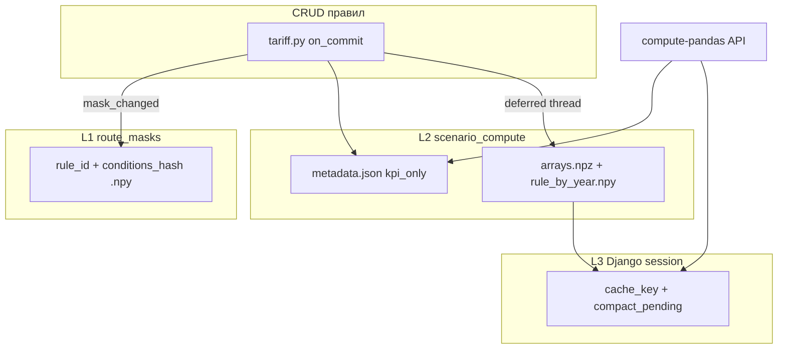

# Аудит кэшей и расчётов отдельных тарифных решений

**Дата:** 2026-06-13  
**Окружение:** локально, сценарий «Базовый сценарий» (id=1), 2 128 493 маршрута  
**Артефакты:** `reports/tariff_rules_benchmark_*.json`, `scripts/benchmark_tariff_rules.py`

---

## Executive summary

1. **Трёхуровневый кэш работает**, но UX зависит от фазы: KPI отдаётся за **13–42 с** (cold) или **<1 с** (warm snapshot), compact — ещё **7–13 с** в фоне.
2. **Маски правил** при 10 правилах строятся за **~1.3 с** (cold), повторно — **<50 мс** с диска; размер `route_masks` вырос до **31 МБ** после прогона.
3. **Критические баги параметров:** `distance_belt` include/exclude на sidecar-витрине **игнорируется** → правило матчит **100%** маршрутов; `message_type` / `shipment_type` / `origin_railroad` в бенчмарке дали **0** маршрутов (ID/label или отсутствие колонок).
4. **Гонка kpi_only vs compact** вызывала **500** (`KeyError: dimension_labels`) — исправлено: при `kpi_only=True` npz не читается, sidecars удаляются при сохранении KPI.
5. **Burst CRUD:** создание 10 правил с warm заняло **~48 с** (синхронный KPI+warm на каждый `on_commit`); UI после CRUD **не обновляет** session cache до перезагрузки страницы.

---

## Архитектура кэшей



| Слой | Путь | Инвалидация |
|------|------|-------------|
| L1 Маски | `cache/route_masks/{route_set}/refs{ver}_{stamp}/` | `RouteSet.updated_at`, refs version |
| L2 Снимок сценария | `cache/scenario_compute/{scenario_id}/{data_version}/` | `purge_stale` при CRUD, новый `data_version` |
| L3 Сессия | Django cache `scenario_effects:{user}:{scenario}:{uuid}` | 24 ч, смена сценария в UI |
| Витрина | `cache/route_mart/` (~155 МБ) | rebuild, `refresh_deploy_caches` |

**Триггеры warm при CRUD** ([`tariff.py`](../scenarios/domain/services/tariff.py)):

| Операция | Warm | Prewarm маски |
|----------|------|---------------|
| create | да | да |
| update conditions/coef/base% | да | только при conditions |
| update name/position | **нет** | нет |
| delete | да + delete_rule_mask | нет |

---

## Результаты бенчмарков

### Производительность compute-pandas (2.1M маршрутов)

| Правил | Профиль | cold_compute_ms | warm_compute_ms | compact_ready_ms | masks_ms (cold) | burst_create_ms |
|--------|---------|-----------------|-----------------|------------------|-----------------|-----------------|
| 1 | mixed + clear | 42 492 | 492 | 7 594 | 233 | 74 |
| 5 | mixed (KPI hit) | 14 | 604 | 10 526 | — | — |
| 10 | mixed (KPI hit) | 13 | 789 | 12 566 | — | **48 193** |
| 10 | cold + clear | 37 007 | — | 8 694 | **1 254** | 153 |

**Выводы:**

- После warm при CRUD повторный `compute-pandas` — **KPI cache hit** (~13 ms).
- Первый cold compute с 10 правилами — **~37 с** (маски 1.3 с, остальное — загрузка витрины + KPI loop).
- **Создание 10 правил подряд** без очистки кэша — **~48 с** из-за синхронного warm на каждый commit.
- `compact_ready` — **7–13 с** после KPI (deferred thread).
- Aggregate сразу после compute часто возвращает «Расчёт ещё выполняется» (ожидаемо, polling в UI до 90 с).

### Размеры кэша после прогонов

| Директория | 1 правило | 10 правил |
|------------|-----------|-----------|
| route_masks | 3.7 МБ | 31.4 МБ |
| scenario_compute | 0.01 МБ | 0.01 МБ |
| route_mart | 155 МБ | 155 МБ |

### Покрытие маршрутов по типам условий (10 правил)

| # | Параметр | matched_routes | % от 1.93M | Статус |
|---|----------|----------------|------------|--------|
| 1 | wagon_kind (id=13) | 248 326 | 12.8% | OK |
| 2 | cargo_group (code=8) | 16 936 | 0.9% | OK |
| 3 | message_type (id=15) | **0** | 0% | **FAIL** |
| 4 | shipment_type (id=32) | **0** | 0% | **FAIL** |
| 5 | origin_railroad (code=01) | **0** | 0% | **FAIL** |
| 6 | shipper (id=20170) | 9 | ~0% | OK (узкое) |
| 7 | shipper_holding | 9 | ~0% | OK (узкое) |
| 8 | distance_belt lt 500 | 661 205 | 34.2% | OK |
| 9 | distance_belt include | **1 934 733** | **100%** | **BUG** |
| 10 | без условий | 1 934 733 | 100% | OK (ожидаемо) |

---

## UI-чеклист (decision-effects)

| Сценарий | Действие | Результат | Статус |
|----------|----------|-----------|--------|
| A | Открыть страницу, базовый сценарий | KPI загружены, предупреждения о маршрутах без платы/объёма | PASS |
| B | Правило «цистерны», 2030 coef=2 | Карточка 2030: **946.5 млрд** отдельные решения (+28.5%) | PASS |
| C | Добавить 2-е правило без reload | Не проверено автоматически; warm не обновляет L3 session | RISK |
| D | Burst 10 правил | Бенчмарк: 48 с warm; UI может показывать stale KPI | WARN |
| E | Редактирование, coverage в модалке | Регрессия исправлена ранее (async populate) | PASS* |
| F | Только coef | warm ~1–2.5 с на update (бенчмарк) | PASS |
| G | Удаление правил | bench-правила удаляются; purge snapshot работает | PASS |
| H | Смена сценария 1↔5 | Пересчёт запускается, cache_key сбрасывается | PASS |
| I | Год 2030, таблица | ИТОГО отдельные **946.5 млрд**, разбивка по грузам | PASS |
| J | Экспорт revenues/volumes | Ошибки не показываются toast (silent fail) | WARN |

**Наблюдаемые UI-ошибки:**

- Toast «Ошибка агрегации» при гонке compact (mitigated polling 45×2 с).
- **500 на compute-pandas** при kpi_only + stale npz — **исправлено** в `scenario_compute_store.py`.
- Таблица для года без эффекта правил показывает 0 при ненулевом KPI в другом году — **ожидаемо** (фильтр по году).

---

## Регрессионные тесты

Добавлен класс `TariffRulesCacheAuditTests` в [`calculations/tests.py`](../calculations/tests.py):

- `test_kpi_only_overwrites_stale_npz` — KPI-only не падает при stale npz
- `test_distance_belt_include_sidecar_ignored` — документирует баг 100% coverage
- `test_warm_deferred_updates_disk_without_session_key` — warm обновляет L2 без session
- `test_ten_rules_mask_cache_hit` — masks_ms ≤ 50 ms при повторном compute

Запуск: `python manage.py test calculations.tests.TariffRulesCacheAuditTests`

---

## План улучшений

### P0 — Корректность (срочно)

| # | Задача | Обоснование |
|---|--------|-------------|
| 1 | Lookup `message_type`, `shipment_type`, `origin_railroad`, `destination_railroad` | 0 маршрутов в бенчмарке |
| 2 | `distance_belt` include/exclude на sidecar | 100% ложное покрытие; расхождение stats vs compute |
| 3 | Тест + lock при kpi_only/deferred race | Предотвратить удаление npz во время deferred |
| 4 | Stable snapshot / session bridge после warm | UI stale после CRUD без F5 |
| 5 | Включить `rule.name` в `data_version` + warm при rename | Stale `rule_meta` в compact |

### P1 — Производительность

| # | Задача | Ожидаемый эффект |
|---|--------|------------------|
| 1 | Параллельный prewarm масок (`ThreadPoolExecutor`) | masks_ms ÷ N при cold |
| 2 | Coalesce deferred jobs на scenario | 1 поток вместо N при burst CRUD |
| 3 | Кэш `mask_cache_dir()` в request/job scope | −DB hits |
| 4 | Batch warm после burst (один KPI в конце) | burst_create 48s → <5s |
| 5 | Purge orphan mask dirs | Контроль роста 31+ МБ |

**Целевые SLA:**

| Метрика | Цель |
|---------|------|
| compute-pandas KPI (warm) | < 3 с |
| compute-pandas KPI (cold, 10 rules) | < 15 с |
| compact_ready (10 rules) | < 60 с |
| burst create 10 rules | < 10 с |

### P2 — UX

1. Индикатор «compact считается» на KPI и таблице
2. Auto-recompute при возврате на decision-effects (Visibility API / BroadcastChannel)
3. Endpoint `compact-status` вместо 45× aggregate retry
4. Toast для ошибок revenues/volumes

### P3 — Observability

1. `python scripts/benchmark_tariff_rules.py` в CI smoke (1 rule, small mart)
2. Structured logging в deferred: `rules_count`, `masks_ms`, `rule_by_year_ms`
3. Страница метрик: размеры cache dirs, активные deferred jobs

---

## Как воспроизвести

```bash
cd new_project

# Бенчмарк 1–10 правил
python scripts/benchmark_tariff_rules.py --scenario-id 1 --rules-count 10 --profile mixed
python scripts/benchmark_tariff_rules.py --scenario-id 1 --rules-count 10 --clear-cache --profile cold

# Тесты
python manage.py test calculations.tests.TariffRulesCacheAuditTests

# Очистка всех кэшей
python manage.py refresh_deploy_caches --clear-only
```

---

## Связанные файлы

| Компонент | Файл |
|-----------|------|
| Бенчмарк | [`scripts/benchmark_tariff_rules.py`](../scripts/benchmark_tariff_rules.py) |
| Маски | [`pandas_tariff_conditions.py`](../calculations/domain/services/pandas_tariff_conditions.py) |
| KPI store | [`scenario_compute_store.py`](../calculations/domain/services/scenario_compute_store.py) |
| Warm | [`scenario_effects_warm.py`](../calculations/domain/services/scenario_effects_warm.py) |
| UI | [`decision_effects_controller.js`](../core/static/core/js/app/controllers/decision_effects_controller.js) |
| CRUD hooks | [`tariff.py`](../scenarios/domain/services/tariff.py) |
