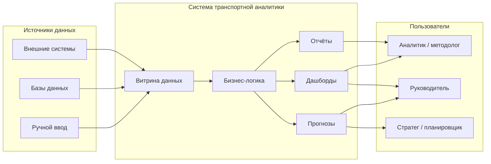

# Обоснование целесообразности создания полноценной системы транспортной аналитики

**Адресат:** Министерство транспорта Российской Федерации (как заказчик)  
**Предмет:** сравнение интегрированной аналитической платформы и изолированного BI-дашборда  
**Характер документа:** мотивированное обоснование архитектурного выбора

---

## 1. Резюме для руководства

Дашборд — это инструмент **представления** уже подготовленных показателей. Он отвечает на вопрос «что происходит сейчас?» и полезен для оперативного мониторинга. Однако для ведомства, отвечающего за транспортную политику, инфраструктурное планирование и межотраслевую координацию, этого недостаточно.

Полноценная система транспортной аналитики **формирует, верифицирует и прогнозирует** управленческие показатели. Она объединяет:

- интеграцию разнородных источников данных;
- единую витрину с согласованной семантикой показателей;
- документированную бизнес-логику расчётов и сценарного моделирования;
- многоканальный выход: формальные отчёты, оперативные дашборды и прогнозы.

**Ключевой тезис.** Для заказчика уровня Министерства транспорта критичны не красота визуализаций, а **воспроизводимость** расчётов, **прослеживаемость данных** (data lineage) и возможность **сценарного моделирования** («что если?»). Дашборд без витрины и расчётного ядра создаёт иллюзию управляемости при сохранении фрагментации данных и методологической непрозрачности.

Рекомендация: формировать техническое задание и оценивать предложения подрядчиков исходя из модели **платформы поддержки принятия решений** (decision support platform), в которой дашборд — один из выходных каналов, а не самостоятельный продукт.

С точки зрения заказчика выбор архитектуры определяет не только удобство работы аналитиков, но и качество государственной транспортной политики: скорость подготовки обоснований, согласованность цифр между подразделениями и способность заранее оценивать последствия мер, а не только фиксировать их постфактум.

---

## 2. Проблематика подхода «только дашборд»

Практика внедрения «быстрых» BI-решений в органах исполнительной власти и крупных инфраструктурных организациях выявляет системные ограничения. Запрос на «дашборд» часто формулируется как потребность в наглядности. На деле за ним скрывается более глубокая потребность: в достоверных, сопоставимых и своевременно обновляемых показателях. Если решить только задачу наглядности, корень проблемы — разрозненность данных и методик — остаётся нетронутым.

### 2.1. Информационная асимметрия и фрагментация данных

При отсутствии единого контура подготовки данных каждый департамент, подведомственная организация и подрядчик оперируют собственными выгрузками, справочниками и правилами агрегации. Возникает **информационная асимметрия**: одни и те же показатели (грузооборот, пассажиропоток, загрузка инфраструктуры, экономический эффект мер) получают разные численные значения в зависимости от источника подготовки.

Дашборд в такой среде не устраняет проблему — он **маскирует** её: на экране отображается одна «истина», но за кадром сохраняется ручная подготовка Excel-файлов, несогласованные методики и отсутствие аудита изменений.

### 2.2. Невоспроизводимость аналитических выводов

Управленческое решение, принятое на основе дашборда, должно быть защищаемо: перед коллегией, в межведомственном согласовании, при взаимодействии с регуляторами и контрольными органами. Если методика расчёта не формализована, не версионирована и не привязана к зафиксированному срезу исходных данных, результат **невоспроизводим**. Через месяц невозможно ответить на вопрос: «какие допущения и какие данные лежали в основе этой цифры?»

Отсутствие воспроизводимости превращает аналитику в разовое мероприятие. Каждый новый запрос руководства запускает новый цикл ручной подготовки, а не обращение к сохранённому сценарию с известными параметрами. Это увеличивает время реакции ведомства и снижает доверие к цифрам.

### 2.3. Ограниченный аналитический горизонт

Изолированный дашборд, как правило, ориентирован на описание прошлого и текущего состояния. Для Министерства транспорта не менее важны вопросы перспективного характера: как изменится нагрузка на инфраструктуру при изменении регуляторных условий; каковы последствия альтернативных вариантов мер; какие сценарии устойчивы к внешним шокам (волатильность рынков, переориентация потоков, макроэкономические колебания).

Без модуля прогнозов и сценарного моделирования дашборд остаётся инструментом наблюдения, а не инструментом **упреждающего управления**. Стратегическое планирование при этом уходит во внешние таблицы и презентации, снова разрывая связь с оперативным мониторингом.

### 2.4. Сравнительный анализ подходов

| Аспект | Только дашборд | Полноценная система транспортной аналитики |
|--------|----------------|--------------------------------------------|
| Источники данных | Зависимость от ручной подготовки Excel/отчётов | Конвейер интеграции: внешние системы, базы данных, контролируемый ручной ввод |
| Методология | Расчёты «за кадром», часто вне системы | Документированная бизнес-логика, версионирование параметров и сценариев |
| Горизонт анализа | Ретроспектива и текущее состояние | Прогнозы, стресс-тесты, сценарии «что если?» |
| Результат для заказчика | Картина для экрана | Отчёты для комитетов, дашборды для мониторинга, прогнозы для планирования |
| Единый источник правды | Отсутствует или формален | Обеспечивается витриной данных и единой семантикой показателей |
| Совокупная стоимость владения (TCO) | Низкие стартовые затраты, высокие скрытые операционные издержки | Более высокие начальные инвестиции, снижение операционных издержек и регуляторных рисков |

### 2.5. Скрытые издержки «дешёвого» решения

Дашборд нередко выбирают как «быстрый и недорогой» вариант. На практике стоимость **переносится** на:

- постоянную ручную подготовку и сверку данных;
- согласование методик между подразделениями после каждого расхождения цифр;
- повторную подготовку материалов к совещаниям и комитетам;
- риск ошибочных управленческих решений из-за непрозрачных допущений.

Таким образом, низкая цена внедрения не эквивалентна низкой **совокупной стоимости владения**.

---

## 3. Архитектура полноценной системы

Ниже представлена логическая схема, соответствующая целевой модели интегрированной транспортной аналитики.

### 3.1. Источники данных

Система должна принимать данные из трёх классов источников:

1. **Внешние системы** — ведомственные и отраслевые информационные системы, автоматизированные потоки обмена.
2. **Базы данных** — структурированные хранилища оперативного и справочного учёта.
3. **Ручной ввод** — экспертные корректировки, параметры сценариев, нормативно-справочные уточнения, которые невозможно или нецелесообразно получать автоматически.

Критично не «собрать всё в одном месте», а обеспечить **управляемую актуальность**, контроль качества и прослеживаемость происхождения каждого показателя.

### 3.2. Витрина данных (Data Mart)

Витрина — слой, в котором исходные данные приводятся к единой модели: нормализация справочников, согласованные единицы измерения, агрегаты для аналитики, маски и признаки для расчётных правил.

Именно витрина создаёт **единый источник правды (Single Source of Truth)**. Без неё дашборды, отчёты и прогнозы неизбежно расходятся: каждый канал потребления опирается на свой промежуточный файл или собственный SQL-запрос.

### 3.3. Бизнес-логика

Бизнес-логика — расчётное и методологическое ядро системы. Здесь формализуются:

- правила расчёта показателей и эффектов решений;
- параметры сценариев и их версионирование;
- модели реакции спроса и нагрузки (в том числе эластичность, выпадение объёмов, чувствительность к регуляторным мерам);
- процедуры сопоставимости сценариев по периоду и составу данных.

**Это слой, которого принципиально нет у изолированного дашборда.** Дашборд может красиво отобразить результат, но не может гарантировать, что результат получен по утверждённой методике и на согласованном срезе данных.

### 3.4. Выходные модули: отчёты, дашборды, прогнозы

Один и тот же расчётный контур питает три канала потребления:

| Канал | Назначение | Типичный потребитель |
|-------|------------|----------------------|
| **Отчёты** | Формальные материалы для комитетов, коллегий, межведомственных согласований | Аналитики, методологи, секретариаты |
| **Дашборды** | Оперативный мониторинг ключевых показателей | Руководители, аналитики |
| **Прогнозы** | Стратегическое планирование, оценка последствий мер, стресс-тесты | Стратеги, планировщики, руководство |

Разные роли используют разные комбинации каналов: кому-то нужны отчёт и дашборд, кому-то — дашборд и прогноз. Важно, что все они опираются на **одну витрину и одну бизнес-логику**. Это устраняет ситуацию, когда «мониторинг показывает одно, а записка в коллегию — другое».

С точки зрения организационного дизайна такая архитектура поддерживает разделение труда без потери согласованности:

- аналитик и методолог настраивают сценарии, проверяют методику и готовят формальные материалы;
- руководитель получает сжатый мониторинг и ключевые прогнозные индикаторы;
- стратег и планировщик работают с альтернативными траекториями развития и оценкой последствий мер.

Все три роли «видят» разные представления одной и той же модели — это принципиальное отличие от набора несвязанных отчётов и экранов.

---

## 4. Ценность для Министерства транспорта как заказчика

### 4.1. Политика, основанная на доказательствах (evidence-based policy making)

Транспортные решения — тарифные, инвестиционные, регуляторные — затрагивают экономику регионов, грузоотправителей, пассажиров и бюджетную эффективность инфраструктуры. Заказчику необходима возможность не только увидеть показатель, но и **проверить цепочку**: исходные данные → допущения → расчёт → вывод.

Система с документированной бизнес-логикой превращает аналитику из «экспертного мнения в слайде» в **верифицируемую модель**.

### 4.2. Межведомственная согласованность показателей

Министерство транспорта взаимодействует с широким кругом стейкхолдеров: инфраструктурные организации, регуляторы, органы экономического планирования, субъекты Российской Федерации. Расхождения в цифрах на межведомственных совещаниях подрывают доверие к обоснованиям и замедляют принятие решений.

Единая витрина и единая семантика показателей обеспечивают **сопоставимость** материалов, подготовленных разными подразделениями и для разных аудиторий.

### 4.3. Регуляторная прозрачность и защищаемость решений

Обоснование мер государственной транспортной политики должно выдерживать проверку на воспроизводимость. Система фиксирует:

- версию исходных данных;
- параметры сценария;
- методику расчёта;
- автора и время формирования результата.

Это снижает риск оспаривания цифр и ускоряет подготовку материалов для согласований.

### 4.4. Снижение операционных и методологических рисков

«Excel-зоопарк» — устойчивая практика, при которой знания о методике живут в головах отдельных специалистов и в неконтролируемых файлах. Текучесть кадров, ошибки копирования, потеря версий — прямые операционные риски.

Централизованная система с аудитом изменений параметров снижает зависимость от «ручного контура» и повышает устойчивость аналитической функции ведомства.

### 4.5. Стратегический горизонт: от мониторинга к прогнозированию

Дашборд по определению силён в ретроспективе и текущем состоянии. Стратегические задачи Министерства — оценка последствий регуляторных мер, прогноз нагрузки на инфраструктуру, сценарное планирование грузовых и пассажирских потоков — требуют **прогнозного контура**, связанного с той же методологией, что и оперативный мониторинг.

Наличие модуля прогнозов внутри той же архитектуры означает, что стратегическое планирование не «живёт отдельной жизнью» от оперативной аналитики.

### 4.6. Масштабируемость без перестройки визуализаций

При появлении новых источников данных, показателей или сценариев в зрелой архитектуре изменения локализуются в витрине и бизнес-логике. Дашборды и шаблоны отчётов переиспользуют уже согласованные метрики. В модели «только дашборд» каждое расширение часто означает повторную ручную перестройку датасетов и визуализаций.

### 4.7. Экономическое обоснование (TCO)

| | Дашборд как самостоятельный продукт | Система транспортной аналитики |
|--|-------------------------------------|--------------------------------|
| Стартовые инвестиции | Ниже | Выше (витрина, интеграции, расчётное ядро) |
| Операционные издержки | Высокие (ручная подготовка, сверки, переделки) | Ниже при зрелой эксплуатации |
| Риск методологических ошибок | Высокий | Контролируемый за счёт формализации |
| Ценность повторного использования | Низкая | Высокая: модели и сценарии переиспользуются |
| Амортизация инвестиций | Слабая | За счёт сокращения цикла подготовки материалов и снижения регуляторных рисков |

**Вывод по экономике.** Дашборд дешевле на старте, но переносит стоимость на скрытый ручной труд и организационные риски. Система дороже на входе, но **амортизирует** инвестиции через повторное использование моделей, ускорение подготовки обоснований и повышение качества решений.

Дополнительный экономический эффект для заказчика — снижение **стоимости ошибки**. Неверная интерпретация показателя или несопоставимые методики на этапе принятия регуляторного или инвестиционного решения могут привести к издержкам, на порядки превышающим разницу в цене между «дашбордом» и полноценной платформой. Система не устраняет неопределённость среды, но снижает неопределённость, порождённую самим аналитическим процессом.

---

## 5. Дашборд и система: разные классы инструментов

Необходимо чётко развести понятия, чтобы избежать подмены в технических заданиях и коммерческих предложениях.

- **Дашборд** — слой **визуализации** (visualization layer). Его функция — наглядно представить показатели, задать фильтры, обеспечить быстрый обзор.
- **Система транспортной аналитики** — **платформа поддержки принятия решений** (decision support platform). Её функция — обеспечить единый контур данных, расчётов, сценариев и многоканальной выдачи результатов.

Метафора для управленческой коммуникации: дашборд без витрины и бизнес-логики подобен **монитору на стене без электростанции**. Экран есть; энергии, которая производит достоверные и сопоставимые показатели, нет.

Практическое следствие для заказчика: закупка «дашборда» без требования к слоям данных и бизнес-логики **не решает** задачу ведомственной аналитики — она лишь оформляет уже существующий (часто ручной) процесс подготовки цифр.

---

## 6. Перспективное усиление: интеллектуальные компоненты

В зрелой платформе перспективны средства интеллектуальной поддержки: ускоренный поиск по сценариям и результатам расчётов, генерация черновиков отчётных материалов, калибровка прогнозных моделей. Принципиально, чтобы такие компоненты работали **внутри** системы — с прослеживаемостью к первичным данным и расчётному ядру, а не как автономные инструменты без связи с утверждённой методикой. Иначе риск «убедительных, но непроверяемых» ответов только возрастает.

---

## 7. Заключение и рекомендации

### 7.1. Итоговая позиция

Для Министерства транспорта как заказчика целесообразен выбор в пользу **полноценной системы транспортной аналитики**, а не изолированного дашборда. Архитектурно это означает обязательное наличие:

1. управляемой интеграции источников данных (внешние системы, базы данных, ручной ввод);
2. витрины данных как единого источника правды;
3. документированной и версионируемой бизнес-логики;
4. трёх выходных каналов: отчёты, дашборды, прогнозы.

Дашборд при этом сохраняет важную роль — но как **канал потребления**, а не как замена аналитической платформы.

### 7.2. Рекомендации при формировании технического задания

Рекомендуется явно зафиксировать в ТЗ и критериях оценки предложений подрядчиков следующие требования:

1. **Документированная методика расчётов** — описание формул, допущений и единиц измерения, доступное заказчику.
2. **Версионирование сценариев и срезов данных** — возможность воспроизвести результат через заданный период.
3. **Многоканальный выход** — отчёты для формальных процедур, дашборды для мониторинга, прогнозы для стратегического планирования на общей методологической базе.
4. **Интеграция с источниками** — не только «загрузка файла», но и конвейер обновления с контролем качества.
5. **Аудит изменений** — фиксация того, кто, когда и какие параметры менял.
6. **Сопоставимость показателей** — единая семантика для всех потребителей результатов.

### 7.3. Критерий выбора

Предложение подрядчика следует оценивать не по числу графиков на экране, а по ответу на вопрос:

> Обеспечивает ли решение единый, воспроизводимый и защищаемый контур «данные → расчёт → управленческий вывод» для разных ролей заказчика?

Если ответ отрицательный, перед ведомством — инструмент визуализации, а не система транспортной аналитики.

---

*Документ предназначен для использования при подготовке обоснования закупок, технических заданий и обсуждении архитектурного выбора с заинтересованными сторонами.*
